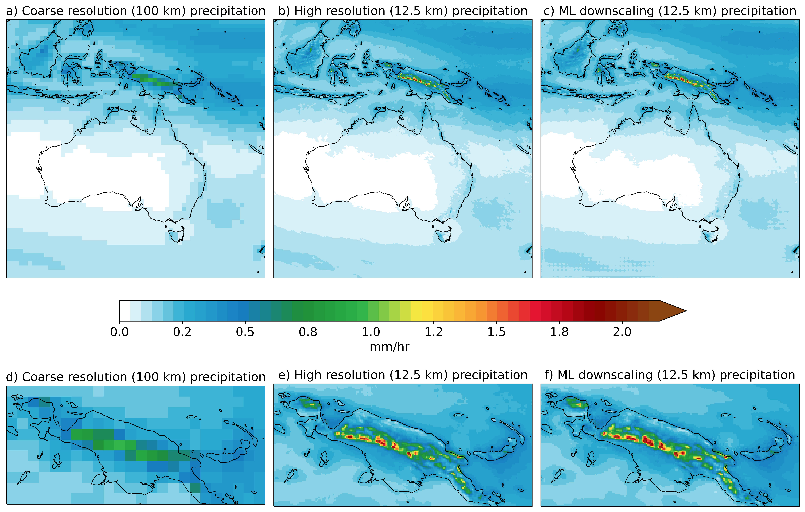

# Super-Resolution-Precipitation-Downscaling
This project applies Super-Resolution Deconvolutional Neural Networks with step orography (SRDN-SO) to downscale hourly precipitation from 100 km to 12.5 km over Australia.

## Key Features
- 8× spatial resolution enhancement
- Orography input at various model stages
- Distributed training with Horovod
- Evaluation with PSNR, SSIM, and spectral FFT
- **Trained on a massive dataset:**
  - Total images: 359,424
  - Training set: 286,720 samples
  - Test set: 72,704 samples
- **Scalable distributed training across 80 GPUs** on the Gadi supercomputer (NCI Australia)
This setup enables rapid and efficient training of deep learning models on large-scale high-resolution climate data.

## Example Output

The figure below compares test period climatology of coarse-resolution input (100 km) (a, d), high-resolution ground truth (12.5 km) (b, e), and machine learning-based downscaled precipitation (12.5 km) (c, f) over Australia and Papua New Guinea:

## Publication
This work is published in the journal *Environmental Data Science*:
**A precipitation downscaling method using a super-resolution deconvolution neural network with step orography**  
DOI: [10.1017/eds.2023.18](https://doi.org/10.1017/eds.2023.18)
## Scripts Overview
- **SRDN_SO.py**: Defines the SRDCNN_STEP_ORO model architecture with progressive deconvolution and orography fusion.
Returns a compiled Keras model optimized for Horovod-based distributed training.
- **utils.py**: Contains helper functions to normalize orography, load precipitation data, and align input shapes.
Used for preprocessing inputs for both training and evaluation phases.
- **train_model.py**: Trains the SRDCNN_STEP_ORO model using Horovod for distributed GPU training on precipitation data.
Handles data loading, preprocessing, training callbacks, and model checkpointing.
- **model_predictions.py**: Runs inference using multiple deep learning models on downscaled precipitation data with orography.
Evaluates performance using PSNR, SSIM, MSE, and frequency spectrum, and saves outputs as NetCDF.
